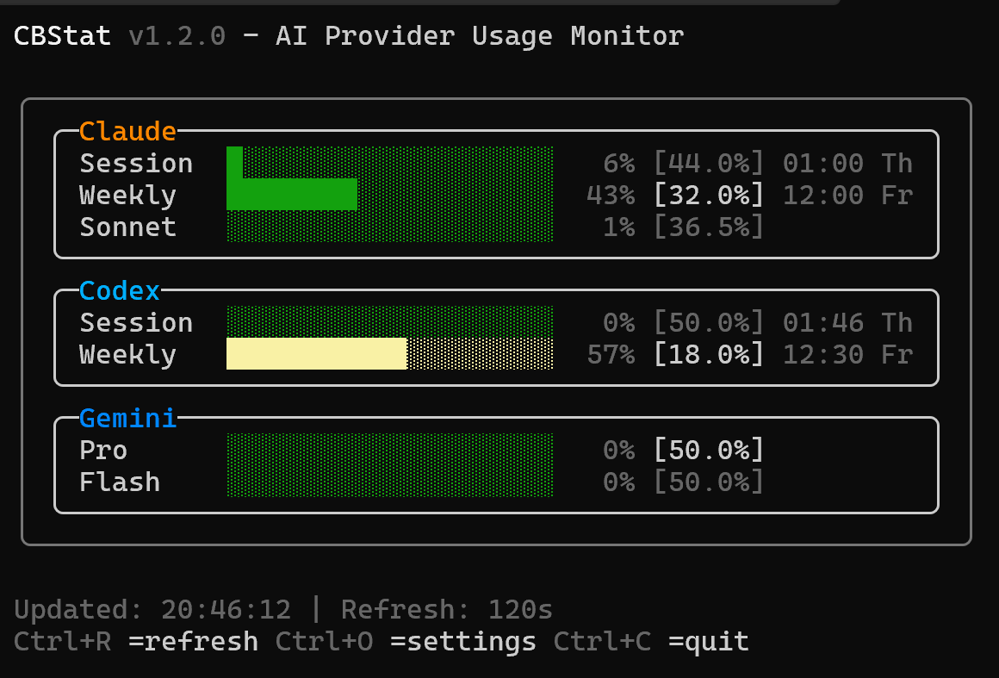
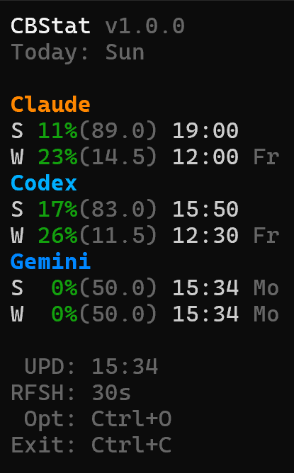
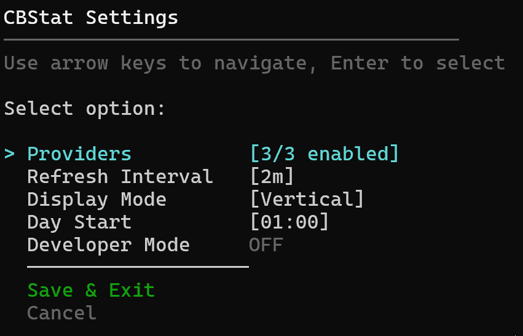
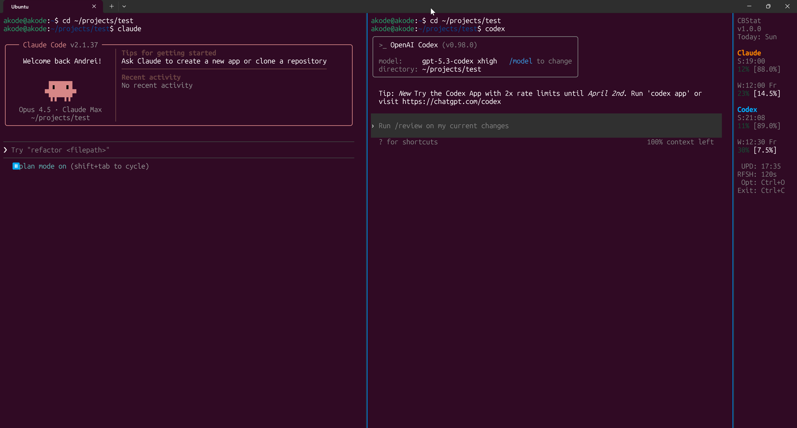

# cbstat

`cbstat` is a cross-platform terminal app that helps you monitor AI provider usage and avoid accidental overuse.

It supports Claude, Codex, and Gemini, and renders usage in a clean live view using `Spectre.Console`.

## Why it is useful

When you work for many hours, it is easy to spend too much quota early and get blocked later.

`cbstat` shows:
- current usage percent for each window
- your safe daily pace in square brackets
- color risk level so you can spot overload early

## What numbers and colors mean

Compact mode example:

```text
S:19:00
12% [88.0%]

W:12:00 Fr
23% [14.5%]
```

- `S` means session window (intra-day window).
- `W` means weekly window.
- Time after `S:` / `W:` is the provider reset time for that specific window, shown in your local time.
- For `S`, this is reset time of the intra-day session window.
- For `W`, this is reset time of the weekly window.
- `23%` is current usage in that provider window.
- `[14.5%]` is how much you can still safely spend today to stay on pace.
- Colors for the main percent:
1. Green: under 50%
2. Yellow: 50-79%
3. Red: 80% and above (higher risk of overspending)

## Screenshots

Vertical mode:



Compact mode:



Compact settings:



Windows + WSL setup example:



## Requirements

- [.NET 10 SDK](https://dotnet.microsoft.com/download/dotnet/10.0)
- [CodexBar CLI](https://github.com/steipete/CodexBar.git) installed and configured

## Privacy and safety

`cbstat` works on your computer and has no cloud backend.

- No telemetry
- No tracking
- No hidden uploads to developer servers
- Settings are stored locally on your machine

The app reads usage data through your local `codexbar` command and only displays it in your terminal.

Short version: this is a local monitoring tool, not a virus, and it does not "leak" your usage data to us.

## Install

### Option 1: Download release binary

Get the latest binary from:

[https://github.com/akode-dev/CBStat/releases](https://github.com/akode-dev/CBStat/releases)

### Option 2: Build from source

```bash
git clone https://github.com/akode-dev/CBStat.git
cd CBStat
dotnet build -c Release
```

## Provider setup

### Windows

On Windows, CodexBar should run inside WSL. `cbstat` calls WSL automatically.

1. Install WSL: `wsl --install`
2. Inside WSL, install CodexBar:  
   [https://github.com/steipete/CodexBar](https://github.com/steipete/CodexBar)
3. Run `cbstat` from Windows terminal

### Linux / macOS

Install CodexBar directly with the same guide:

[https://github.com/steipete/CodexBar](https://github.com/steipete/CodexBar)

## Usage

Run:

```bash
cbstat
```

Or from source:

```bash
dotnet run --project src/Akode.CBStat
```

Command line options:

```text
cbstat [options]

Options:
  -i, --interval <seconds>   Refresh interval (default: 120)
  -p, --providers <list>     Comma-separated providers (claude,codex,gemini)
  -t, --timeout <seconds>    Command timeout (default: 30)
      --dev                  Use sample data (developer mode)
  -h, --help                 Show help
```

Examples:

```bash
cbstat -i 60
cbstat -p claude,codex
cbstat --dev
```

Keyboard shortcuts:

1. `Ctrl+O`: open settings
2. `Ctrl+C`: quit

## Day Start and daily pacing

Daily pacing uses your **local computer time**.

Default day start is **01:00** local time.  
You can change it in Settings -> `Day Start`.

This matters because your "[daily pace]" value depends on where your personal day boundary starts.

## Real-life example

You work from 09:00 to 19:00 and usually do most heavy tasks in the morning.

At 10:00 you see:

```text
W 52% [6.0%]
```

This means:
- You already used 52% of the window.
- To stay safe, today you should spend only about 6% more.

So you can switch afternoon work to lighter tasks (reviews, refactoring, docs), and keep heavy model usage for tomorrow after reset/day rollover.

## Build and test

```bash
dotnet build CBStat.slnx
dotnet test CBStat.slnx
```

Publish examples:

```bash
dotnet publish src/Akode.CBStat -c Release -r win-x64 --self-contained
dotnet publish src/Akode.CBStat -c Release -r linux-x64 --self-contained
dotnet publish src/Akode.CBStat -c Release -r osx-x64 --self-contained
dotnet publish src/Akode.CBStat -c Release -r osx-arm64 --self-contained
```

## License

MIT
